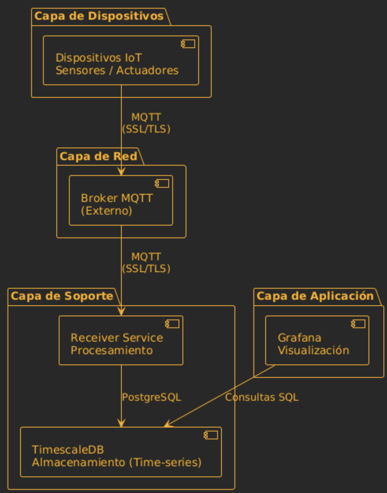
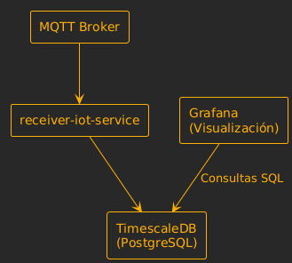

# Receiver IoT Service - Sistema de Captura y Visualización de Datos IoT

## Descripción General

Este repositorio contiene un sistema completo para la captura, almacenamiento y visualización de datos IoT que se reciben a través del protocolo MQTT. El sistema está diseñado para procesar datos de dispositivos IoT que publican información siguiendo un formato específico por localización geográfica.

### ¿Qué hace este sistema?

1. **Captura de datos**: El servicio `receiver-iot-service` escucha mensajes MQTT de dispositivos IoT
2. **Filtrado inteligente**: Solo procesa y guarda datos de tópicos que siguen un formato específico por localización
3. **Almacenamiento temporal**: Los datos se guardan en TimescaleDB, una base de datos optimizada para datos temporales
4. **Visualización**: Grafana permite visualizar y analizar los datos en tiempo real con dashboards preconfigurados

## Arquitectura del Sistema



### Componentes

#### 1. **TimescaleDB** (Base de Datos)
- **Puerto**: `5433`
- **Base de datos**: `iot_data_db`
- **Usuario**: `iot_db_user` / **Contraseña**: `a1b2c3d4`

TimescaleDB es PostgreSQL optimizado para datos temporales (series de tiempo), perfecto para datos IoT.

#### 2. **Receiver IoT Service** (Servicio de Captura)
- **Puerto**: `8080`
- **Funcionalidad**: 
  - Se conecta al broker MQTT
  - Suscribe al tópico: `+/+/+/+/+/+` (acepta `in` y `out`)
  - Filtra y guarda datos válidos en TimescaleDB

**Formato de tópicos**: `pais/provincia/ciudad/id-dispositivo/usuario/in` o `pais/provincia/ciudad/id-dispositivo/usuario/out`

Ejemplos:
- `mexico/cdmx/roma/sensor-001/juan/out`
- `españa/madrid/centro/dispositivo-42/maria/in`
- `usa/california/sanfrancisco/device-123/carlos/out`

#### 3. **Grafana** (Visualización)
- **Puerto**: `3000`
- **Usuario**: `admin` / **Contraseña**: `admin123`
- Dashboard preconfigurado para visualizar datos IoT en tiempo real

## Estructura del Proyecto

```
receiver-timescale/
├── compose.yaml              # Configuración de Docker Compose
├── .env.template             # Plantilla de variables de entorno
├── .env                      # Variables de entorno (no se sube al repo)
├── images/                   # Imágenes y recursos visuales
│   ├── arquitectura-sistema.png  # Diagrama de arquitectura del sistema
│   └── receiver-iot-latest.tar.gz  # Imagen Docker guardada (opcional)
├── grafana/
│   ├── dashboards/           # Dashboards de Grafana
│   │   └── iot-overview.json
│   └── provisioning/         # Configuración automática
│       ├── datasources/      # Fuente de datos (TimescaleDB)
│       └── dashboards/
└── README.md
```

## Requisitos Previos

- **Docker** y **Docker Compose** (versión 2.0 o superior)
- Acceso a Internet para descargar las imágenes Docker

## Ejecución Local

### 1. Clonar el repositorio

```bash
git clone <url-del-repositorio>
cd receiver-timescale
```

### 2. Configurar variables de entorno

Copia el archivo de plantilla `.env.template` a `.env` y completa con tus valores reales:

```bash
cp .env.template .env
```

Luego edita el archivo `.env` y completa los siguientes secrets:

#### Secrets de TimescaleDB
- `POSTGRES_PASSWORD`: Contraseña segura para la base de datos TimescaleDB
- `GRAFANA_DB_PASSWORD`: Debe ser la misma contraseña que `POSTGRES_PASSWORD`

#### Secrets del Receiver IoT Service
- `DB_PASSWORD`: Debe ser la misma contraseña que `POSTGRES_PASSWORD`
- `MQTT_BROKER`: URL de tu broker MQTT (ej: `ssl://tu-broker-mqtt.ejemplo.com:8883`)
- `MQTT_USERNAME`: Usuario para conectarse al broker MQTT
- `MQTT_PASSWORD`: Contraseña para conectarse al broker MQTT
- `MQTT_CLIENTID`: ID único del cliente MQTT (puede ser cualquier valor único)
- `MQTT_TOPIC`: Tópico MQTT a suscribirse (por defecto: `+/+/+/+/+/out`)

#### Secrets de Grafana
- `GF_SECURITY_ADMIN_PASSWORD`: Contraseña del administrador de Grafana

**Ejemplo de archivo `.env` configurado:**

```env
# TimescaleDB
POSTGRES_DB=iot_data_db
POSTGRES_USER=iot_db_user
POSTGRES_PASSWORD=mi_contraseña_segura_123

# Receiver IoT Service
DB_URL=jdbc:postgresql://timescaledb:5432/iot_data_db
DB_USERNAME=iot_db_user
DB_PASSWORD=mi_contraseña_segura_123
JPA_DDL=create-drop
MQTT_BROKER=ssl://mi-broker.com:8883
MQTT_CLIENTID=receiver-cliente-001
MQTT_USERNAME=usuario_mqtt
MQTT_PASSWORD=contraseña_mqtt
MQTT_TOPIC=+/+/+/+/+/out
MQTT_QOS=0

# Grafana
GF_SECURITY_ADMIN_USER=admin
GF_SECURITY_ADMIN_PASSWORD=admin_contraseña_segura
GF_INSTALL_PLUGINS=grafana-worldmap-panel

# Grafana Datasource
GRAFANA_DB_USER=iot_db_user
GRAFANA_DB_PASSWORD=mi_contraseña_segura_123
GRAFANA_DB_NAME=iot_data_db
```

**⚠️ IMPORTANTE:** 
- El archivo `.env` contiene información sensible y **NO debe subirse al repositorio**
- Asegúrate de que `.env` esté en tu `.gitignore`
- Usa contraseñas fuertes y únicas para producción

### 3. Cargar la imagen Docker local (opcional)

Si tienes la imagen guardada localmente en el repositorio, puedes cargarla:

```bash
# Si la imagen está guardada como archivo .tar.gz
docker load < images/receiver-iot-latest.tar.gz
```

Si no tienes la imagen local, Docker Compose la descargará automáticamente desde Docker Hub.

### 4. Iniciar los servicios

```bash
docker compose up -d
```

### 5. Verificar que los servicios están corriendo

```bash
docker compose ps
```

Deberías ver tres servicios con estado "Up":
- `timescale2db`
- `receiver-iot-service`
- `grafana-iot`

### 6. Acceder a los servicios

- **Grafana**: `http://localhost:3000` (usuario: `admin`, contraseña: `admin123`)
- **TimescaleDB**: `localhost:5433` (usuario: `iot_db_user`, contraseña: `a1b2c3d4`)
- **Receiver Service**: `http://localhost:8080`

### Ver logs (opcional)

```bash
# Todos los servicios
docker compose logs -f

# Servicio específico
docker compose logs -f receiver-iot-service
```

## Ejecución Remota

Para ejecutar el sistema en un servidor remoto:

### 1. Copiar archivos al servidor

```bash
# Opción 1: Usando SCP
scp -r receiver-timescale usuario@servidor:/ruta/destino/

# Opción 2: Usando Git
ssh usuario@servidor
git clone <url-del-repositorio>
cd receiver-timescale
```

### 2. Iniciar los servicios en el servidor

```bash
docker compose up -d
```

### 3. Crear túnel SSH para acceder (Recomendado)

En lugar de abrir puertos en el firewall, usa un túnel SSH desde tu máquina local:

```bash
# Túnel para Grafana (puerto 3000)
ssh -L 3000:localhost:3000 usuario@servidor

# Túnel para TimescaleDB (puerto 5433)
ssh -L 5433:localhost:5433 usuario@servidor

# Túnel para Receiver Service (puerto 8080)
ssh -L 8080:localhost:8080 usuario@servidor

# O crear un túnel para todos a la vez
ssh -L 3000:localhost:3000 -L 5433:localhost:5433 -L 8080:localhost:8080 usuario@servidor
```

Luego accede desde tu máquina local como si los servicios estuvieran corriendo localmente:
- Grafana: `http://localhost:3000`
- TimescaleDB: `localhost:5433`
- Receiver Service: `http://localhost:8080`

## Comandos Útiles

```bash
# Detener servicios
docker compose down

# Detener y eliminar datos (borra todo)
docker compose down -v

# Reiniciar un servicio
docker compose restart receiver-iot-service

# Ver estado
docker compose ps

# Actualizar imágenes
docker compose pull && docker compose up -d
```

## Modelo de Referencia de Internet de las Cosas ITU-T Y.4000/Y.2060

Este sistema implementa el modelo de referencia ITU-T Y.4000/Y.2060 para arquitecturas IoT, que define cuatro capas principales:

### Capa de Dispositivos (Device Layer) / Capa de Percepción

**Dispositivos IoT y Sensores**
- Sensores y actuadores físicos que generan y capturan datos del entorno
- Publican mensajes MQTT con el formato: `pais/provincia/ciudad/id-dispositivo/usuario/in` o `out`
- Envían payloads JSON con variables arbitrarias (ej: `{"temperatura": 27.3, "humedad": 65.4}`)
- Conectados a través de redes de acceso (WiFi, Ethernet, LoRaWAN, etc.)

**En este proyecto:**
- Los dispositivos IoT se conectan al broker MQTT externo
- Capturan datos del entorno físico (temperatura, humedad, presión, etc.)

### Capa de Red (Network Layer)

**Conectividad y Transporte**
- Proporciona conectividad entre dispositivos y servicios
- Soporta múltiples tecnologías de red (IP, no-IP)
- Enrutamiento de datos desde dispositivos hacia servicios de procesamiento

**En este proyecto:**
- **MQTT over SSL/TLS** (puerto 8883): Conexión segura entre dispositivos y broker MQTT
- **TCP/IP**: Todas las comunicaciones utilizan TCP para garantizar entrega confiable
- **Docker Networking**: Red interna (`red-backend-app`) para comunicación entre contenedores
- Puertos: 5433 (TimescaleDB), 3000 (Grafana), 8080 (Receiver), 8883 (MQTT)

### Capa de Soporte de Aplicación y Servicio (Service Support Layer)

**Procesamiento y Gestión de Datos**
- Procesamiento de datos recibidos de dispositivos
- Almacenamiento temporal de datos IoT
- Filtrado y validación de mensajes
- Gestión de sesiones y conexiones

**En este proyecto:**
- **Receiver IoT Service**: Procesa mensajes MQTT, filtra por formato de tópico y guarda datos válidos
- **TimescaleDB**: Base de datos optimizada para series temporales, almacena datos históricos de dispositivos
- **Gestión de sesiones MQTT**: Mantiene sesiones persistentes entre el receiver y el broker

### Capa de Aplicación (Application Layer)

**Interfaces y Visualización**
- Aplicaciones que consumen y presentan datos IoT
- Interfaces de usuario para visualización y análisis
- APIs para acceso a datos

**En este proyecto:**
- **Grafana**: Interfaz web para visualización y análisis de datos IoT en tiempo real (puerto 3000)
- **HTTP/HTTPS**: Protocolo para comunicación web (Grafana y API del Receiver)
- **PostgreSQL Protocol**: Protocolo de acceso a base de datos para consultas (TimescaleDB)

### Características Transversales

**Seguridad**
- SSL/TLS para encriptación de datos en tránsito (MQTT over SSL/TLS)
- Autenticación y autorización de dispositivos y servicios

**Gestión**
- Monitoreo de servicios mediante logs y métricas
- Gestión de contenedores Docker
- Verificación de salud de servicios

### Arquitectura del Flujo de Datos




### Ventajas del Modelo ITU-T Y.4000/Y.2060

1. **Arquitectura orientada a IoT**: Diseñado específicamente para sistemas IoT, no adaptado de otros modelos
2. **Separación clara de responsabilidades**: Cada capa tiene funciones específicas para IoT
3. **Escalabilidad**: Facilita la incorporación de nuevos dispositivos y servicios
4. **Interoperabilidad**: Permite diferentes tecnologías en cada capa

## Formato de Tópicos MQTT y Payload

### Formato de Tópicos

El servicio escucha tópicos con el patrón: `+/+/+/+/+/+` (acepta tanto `in` como `out`)

**Estructura:**
```
pais/provincia/ciudad/id-dispositivo/usuario/in
pais/provincia/ciudad/id-dispositivo/usuario/out
```

**Campos:**
- `pais`: País donde se encuentra el dispositivo
- `provincia`: Provincia/estado/región
- `ciudad`: Ciudad específica
- `id-dispositivo`: Identificador único del dispositivo
- `usuario`: Usuario asociado al dispositivo
- `in` o `out`: Dirección del mensaje (entrada o salida)

**Ejemplos válidos:**
```
mexico/cdmx/roma/sensor-001/juan/out
españa/madrid/centro/dispositivo-42/maria/in
usa/california/sanfrancisco/device-123/carlos/out
argentina/buenosaires/palermo/sensor-temp-05/ana/out
```

### Formato del Payload

Los dispositivos envían datos en formato JSON con variables arbitrarias. El payload puede contener cualquier conjunto de mediciones o valores.

**Ejemplo básico:**
```json
{
  "temperatura": 27.3,
  "humedad": 65.4
}
```

**Ejemplos con más variables:**
```json
{
  "temperatura": 27.3,
  "humedad": 65.4,
  "presion": 1013.25,
  "luminosidad": 850,
  "co2": 420
}
```

```json
{
  "voltage": 3.3,
  "corriente": 0.15,
  "potencia": 0.495,
  "estado": "activo"
}
```

**Importante:**
- El payload puede contener cualquier variable o combinación de variables
- No hay un esquema fijo - cada dispositivo puede enviar diferentes mediciones
- Los valores pueden ser numéricos (enteros o decimales) o strings
- El sistema almacenará todas las variables recibidas en la base de datos

## Verificación del Sistema

### Verificar TimescaleDB
```bash
docker compose exec timescaledb psql -U iot_db_user -d iot_data_db -c "\dt"
```

### Verificar conexión MQTT
```bash
docker compose logs receiver-iot-service | grep -i "mqtt\|connected\|subscribe"
```

### Verificar Grafana
1. Accede a `http://localhost:3000`
2. Inicia sesión con `admin` / `admin123`
3. Ve a "Configuration" → "Data Sources"
4. Verifica que "TimescaleDB" está configurada y con estado "OK"

## Solución de Problemas

### Los servicios no inician

Verifica que los puertos no estén en uso:
```bash
# Linux/Mac
lsof -i :3000 -i :5433 -i :8080

# Windows
netstat -ano | findstr :3000
```

### El receiver no se conecta al broker MQTT

Revisa los logs y verifica la configuración en tu archivo `.env`:
```bash
docker compose logs receiver-iot-service
```

### Grafana no muestra datos

1. Verifica que TimescaleDB está funcionando
2. Verifica que el receiver está guardando datos
3. Revisa la conexión de Grafana a TimescaleDB en "Data Sources"

### Los datos no se guardan

1. Verifica que los tópicos MQTT siguen el formato correcto
2. Revisa los logs del receiver: `docker compose logs receiver-iot-service`
3. Verifica que TimescaleDB está saludable: `docker compose ps timescaledb`

## Seguridad

**IMPORTANTE**: Este proyecto usa credenciales por defecto para desarrollo y aprendizaje. **NO uses estas credenciales en producción**.

Para producción:
1. Usa un archivo `.env` con contraseñas fuertes
2. Nunca subas el `.env` a Git
3. Usa túnel SSH en lugar de abrir puertos en el firewall
4. Configura SSL/TLS para todas las conexiones

## Guardar la Imagen Docker Localmente

Para guardar la imagen `alvarosalazar/receiver-iot:latest` en el repositorio (útil para no depender de Docker Hub):

### 1. Descargar la imagen desde Docker Hub

```bash
docker pull alvarosalazar/receiver-iot:latest
```

### 2. Guardar la imagen como archivo comprimido

```bash
# Crear el directorio si no existe
mkdir -p images

# Guardar la imagen como archivo tar comprimido
docker save alvarosalazar/receiver-iot:latest | gzip > images/receiver-iot-latest.tar.gz
```

### 3. Cargar la imagen desde el archivo

Cuando necesites usar la imagen guardada:

```bash
docker load < images/receiver-iot-latest.tar.gz
```

### 4. Verificar que la imagen está cargada

```bash
docker images | grep receiver-iot
```

**Nota:** El archivo de imagen puede ser grande (varios cientos de MB). Asegúrate de tener espacio suficiente en el repositorio o considera usar Git LFS para archivos grandes.

## Recursos Adicionales

- [Documentación de TimescaleDB](https://docs.timescale.com/)
- [Documentación de Grafana](https://grafana.com/docs/grafana/latest/)
- [Documentación de Docker Compose](https://docs.docker.com/compose/)
- [Protocolo MQTT](https://mqtt.org/)

## Notas

- Este sistema está diseñado para aprender sobre IoT, MQTT, bases de datos temporales y observabilidad
- Puedes modificar el `compose.yaml` para cambiar puertos y configuración
- Los dashboards de Grafana se pueden personalizar
- Experimenta con diferentes formatos de tópicos MQTT

---
